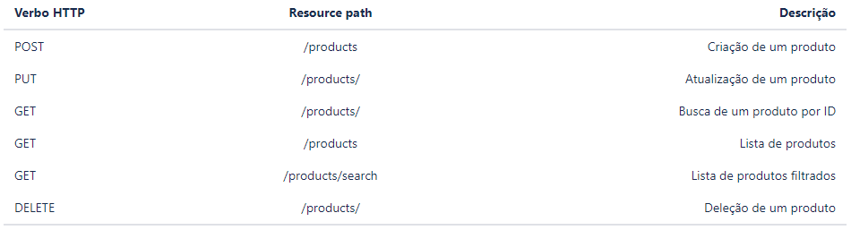

Prova Técnica proposta pela Compass.UOL
Uma API crud, com filtros e exceções
Devem ser disponibilizados os seguintes endpoints para operação do catálogo de produtos:

Acesso ao h2 bd ->
http://localhost:9999/h2
|| JDBC URL: jdbc:h2:file:./data/desafio
|| User Name: sa
|| Password: